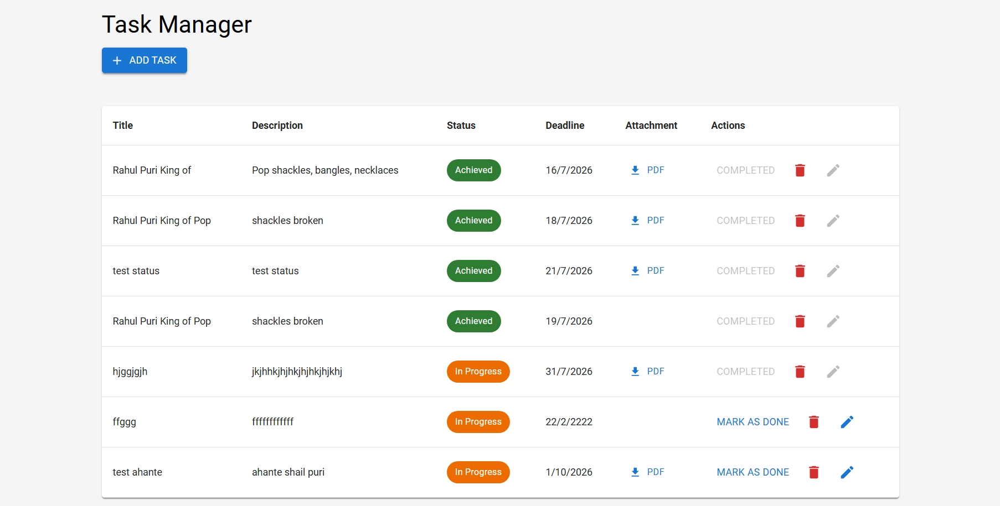

# MERN Task Manager

A full-stack Task Manager application built using the **MERN Stack** (MongoDB, Express.js, React, Node.js) with **Material UI** for a clean and responsive user interface.


## 📑 Table of Contents

- [Features](#-features)
- [Tech Stack](#-tech-stack)
- [Environment Variables](#-environment-variables)
- [Project Structure](#-project-structure)
- [Installation](#-installation)
- [Future Enhancements](#-future-enhancements)
- [Live Demo](#-live-demo)
- [Application Preview](#-application-preview)
- [License](#-license)
- [Author](#-author)

---

## ✨ Features

- Create, Read, Update and Delete (CRUD) tasks
- Mark tasks as completed
- Dynamic task status rendering
  - 🟡 In Progress
  - 🟢 Achieved
  - 🔴 Failed
- Upload PDF attachments
- Download PDF attachments
- Responsive Material UI interface
- Client-side form validation

---

## 🛠️ Tech Stack

### Frontend

- React
- MUI (Material UI)
- Axios
- JavaScript (ES6+)

### Backend

- Node.js
- Express.js
- MongoDB Atlas
- Mongoose
- Multer
- REST API

---

## 🔐 Environment Variables

### Backend (`backend/.env`)

```env
PORT=8082
MONGODB_URI=<your_mongodb_connection_string>
```

### Frontend (`frontend/.env`)

```env
REACT_APP_API_URL=https://task-manager-mern-4m1f.onrender.com/tasks
```

## 🚀 Deployment

- Vercel (Frontend)
- Render (Backend)

---

## 📁 Project Structure

```text
task-manager-mern/
│
├── backend/
│   ├── controllers/
│   ├── models/
│   ├── routes/
│   ├── middleware/
│   └── uploads/
│
├── frontend/
│   ├── public/
│   ├── src/
│   └── package.json
│
├── screenshots/
│   └── task-manager-home.jpeg
│
└── README.md
```

---

## 📋 Prerequisites

- Node.js (v18 or later)
- npm
- MongoDB Atlas account

---

## 🚀 Installation

### Clone the repository

```bash
git clone https://github.com/Rahul-PuriRepo/task-manager-mern.git
```

### Backend

```bash
cd backend
npm install
npm start
```

### Frontend

```bash
cd frontend
npm install
npm start
```

---

## 🚀 Future Enhancements

- User authentication (JWT)
- Task filtering and search
- Due dates and reminders
- Dark mode
- Drag-and-drop task management

---


## 🌐 Live Demo

### Frontend

🔗 [Live Application](https://task-manager-mern-beta-orpin.vercel.app/)

### Backend API

🔗 [Backend API](https://task-manager-mern-4m1f.onrender.com/tasks)

> **Note:** The backend is hosted on Render's free tier, so the first request may take 30–60 seconds while the server wakes up.

---

## 📸 Application Preview



## 📄 License

This project is for learning and portfolio purposes.

## 👨‍💻 Author

**Rahul Puri**

GitHub: [Rahul-PuriRepo](https://github.com/Rahul-PuriRepo)